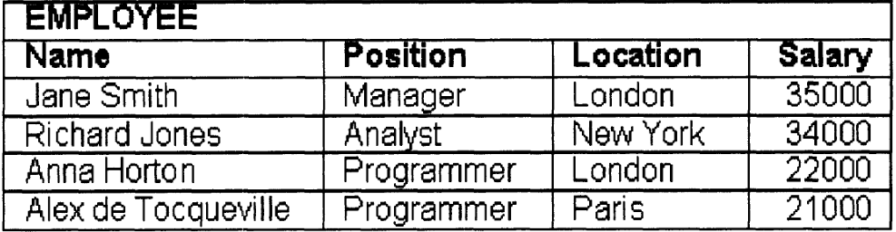

# Chapter 2
---
### 1. data model :
- #### what is data model ? 
	- it is a formalized method of structuring & manipulating data . 
	- every data model should define :
		1. structure : how data is organized (table, rows, columns) .
		2. integrity : how to ensure correctness (primary key, not null, foreign key).
		3. operations : how to work with data (SQL operations) . 
---
### 2. Relational Model (table, row, column):
- it is a logical model used to represent data .
- easy to use & understand .
- #### what is relation ?
	- A logical table made of rows (tuples) and columns (attributes), representing a set of related data .
	- suppose you have the following *sets* :
		- Employee name , position, location, salary .
	- each Employee has only one value of each set .
	- 
	- Row (tuple) = Employee (Real world component) .
	- column = Properties (attributes) of the things we want to store in the database .
	- table = relation .
	- no specific order, each row is unique .
- #### Notes about table (relation) :
	1. each table has :
		- a name -> Employee table .
		- columns, rows .
	2. each column has :
		- name -> "Position" column . 
		- set of allowed values called *domain* -> "Manager, Analyst, Programmer" .
	3. each cell has only one single value .
	4. Number of rows unlimited .
	5. row :
		- must be unique cause each row represents unique instance -> need of primary key .
		- rows order not important .
---
### 3. Domains & Data Types :
- #### Data types :
	- ##### what is it ?
		- it is the type of data that will be stored inside a specific column (numbers, text, date) and hide physical details from the user .
	- ##### is it useful ?
		- it helps DBMS knowing how to (Store & retrieve) data .
	- ##### examples ?
		- numbers -> (INTEGER , DECIMAL) .
		- date/time -> (DATE, TIME, DATETIME) .
		- text -> (CHAR, VARCHAR) .
		- Booleans -> (TRUE, FALSE) .
- #### Domain :
	- ##### what is it ?
		- set of allowed values for specific columns .
	- ##### example ?
		- salary can be any number bigger than 4000 .
	- we can get the effect of domains via Constrains or data entry mechanisms .
---
### 4. missing data : nulls 
- sometimes you don't have a value to put in a column. Two reasons for this are:
	1. unknowing or missing value :
		- customer didn’t provide an email address .
	2. inapplicable value :
		- commission rate for a salaried employee with no commission .
- the previous situations represented with *NULL* in Database .
- NULL is a flag means "no value", not zero or empty .
- can we rely on other values like -1 or "" (empty text)?
	- -1 : no, it may lead to some issues when dealing with some mathematical operations like (avg, sum),  
	- "" empty text : no, it doesn't mean no value it is still a value .
- NULL can't be compared with other values .
- When should you use a default value instead of NULL?  
	- When there is a sensible and meaningful default that fits the business context.
---
### 5. Primary Key :
- Why each row must be unique ?
	- in DB each row identifies a real component like "employee".
	- imagine that we have 2 identical rows for to different persons, how could we know tell them apart ? we can't cause they are identical so there must be something that identify each row .
- #### what is primary key ?
	- it is a unique key which can be one column or multiple columns (composite), used to identify each row in the table .
	- not changeable .
	- not duplicated .
	- each table must have only one primary key, tables may have unique columns which called "alternate key" .
- #### why PK is important ?
	- restrict duplication of rows .
	- used for relationships among tables .
	- for fast search .
	- used for data integrity .
---
### 6. Foreign Key :
- #### what is it ?
	- it is a column or set of columns contains Primary key of another table sometimes it is called reference .
- #### is it important ?
	- use it is used to link related tables with each others, make relations between tables .
	- join related rows from different tables .
- #### notes about foreign key :
	- table contains foreign key called "Child table", table refers to called "parent table" .
	- foreign key values doesn't have to be unique .
	- it must refer to an existing value in parent table .
---
### 7. Normalization :
- #### why we don't put all data in  one big table ?
	- this will lead to more problems cause of *data redundancy* :
		1. waste space :
			- duplicating same data will take more space .
		2. update anomaly :
			- when we want to update data of specific row we must update it in all duplicated rows to avoid inconsistency .
		3. Delete anomaly :
			- if we deleted data of (order), we will remove entire row with all data inside it which may be all data of customer .
		4. insert anomaly .
- #### Normalization :
	- it is an operation of splitting big tables into smaller related tables to avoid data redundancy and anomaly problems .
	- ##### levels of normalization :
		- 1NF : No multivalued attributes (each column must have atomic/single values) .
		- 2NF : no partial dependency (non-key column must depend on the whole composite primary key) (in composite PK) .
		- 3NF : All non-key columns must depend **directly** on the primary key only .
- #### First Normal Form (1NF)
	- **What is it?**
	    - A table is in 1NF if it has **no repeating groups** or **multivalued attributes**.
	- **Goal:**
	    - Ensure that **each column contains only a single (atomic) value**.
	- **How to know you're in 1NF?**
	    - Each column contains only one value.
	    - Each row represents a **single entity instance**.
- #### Second Normal Form (2NF)
	- **What is it?**
	    - A table is in 2NF if it has **no partial dependency**, meaning **non-key attributes depend on the entire composite primary key**, not just part of it.
	- **Goal:**
	    - Ensure that **all non-key columns depend on the whole primary key**.
	    - Eliminate dependencies on **part of a composite key**.
- #### Third Normal Form (3NF)
	- **What is it?**
	    - A table is in 3NF if it has **no transitive dependency**, meaning **non-key columns depend only on the primary key**, and **not on another non-key column**.  
	- **Goal:**
	    - Eliminate **indirect dependencies** by making sure every column is directly dependent on the primary key only.
- #### Fourth Normal Form (4NF)
	- **What is it?**
	    - A table is in 4NF if it has **no multi-valued dependencies** — i.e., **no column contains a set of values related to a single key**.
	- **Goal:**
	    - Ensure that the primary key determines **only single values**, not sets of values (even across rows).
- 

---
### 8. Data Integrity :
- #### What is it?
	- Integrity means that **data is valid and internally consistent**.
	- Integrity is achieved by defining **a set of rules** that the data must comply with.    
- #### Why is it important?
	- To **prevent invalid or inconsistent data** from entering the system.
	- Without enforcement of integrity rules, **unexpected behaviour and bugs** can occur.
	- Assumptions like “a customer can’t have more than 30% discount” are **useless if not enforced**.
- #### When is it defined?
	- Integrity rules are usually defined during the **database design phase**.
- #### Types of Integrity Rules
	1. **Built-in Integrity Rules** (enforced by the DBMS automatically):
	    - Example: **Primary key must be unique** (Entity Integrity Rule).    
	2. **User-Defined Integrity Rules** (defined by the developer):
	    - Example:  
	        - Two employees can't have the same SSN.    
	        - Employee name can’t be null.
	        - Gender must be either `'m'` or `'f'`.    
	        - Credit limit must be between 0–5000 or null.
- #### Best Practices
	-  User-defined rules should be:
	    - **Well-documented**.
	    - **Implemented inside the database** when possible.
	    - **Enforced at the lowest layer** to avoid being bypassed by applications.
	-  In **web apps**, you can:
	    - Use **JavaScript** to enforce client-side integrity (client-side validation) rules before submission.
	    - Make sure rules are downloaded from a **trusted source** (e.g., rule server).
- #### Built-in Integrity Rules (Relational Model) :
	 1. **Entity Integrity**
		- Every row in a table must be uniquely identifiable.
		- Each table must have a **primary key**.
		- A primary key must:
		    - Be **unique**.
		    - **Not contain nulls** in any part of it.
		- Why? Because nulls cannot be compared, so uniqueness can't be guaranteed.
	 2. **Referential Integrity**
		- Any **foreign key** value must:
		    - Refer to an existing value in the **primary key** of the parent table.
		    - Or be **null**.
		- 🧠 Example: In the SALE table, a `CustomerNo` being null is valid. But if it has a value that doesn’t exist in the CUSTOMER table, that breaks referential integrity.
	3. **Domain Integrity**
		- All values in a column must belong to a **predefined set** of valid values (called a domain).
		- Examples:
		    - Gender must be either `'m'` or `'f'`.
		    - Age must be a positive number.
		    - Salary must be within a specific range.
	- ⚠️ Note:
		- **Integrity rules ensure that data is** _**valid**_**, but not necessarily** _**correct**_**.**
		- Example: `"Brain Watlers"` may be valid by the system, but it’s a typo for `"Brian Walters"`.
		- ✅ Best practices:
		    - Use **data verification** (e.g., double entry).
		    - Combine integrity rules + verification for more reliable data.
---
### 9. Metadata & the Data Dictionary :
- #### What do we store in a database?
	- Mainly **data**, but also **metadata**.
- ####  What is Metadata?
	- **Metadata** = "data about data"
	- It includes **definitions** and **structures** of the database, not the actual business data (like sales or customers).
	- Example: When you create a table, the database stores info about that table (its name, columns, keys, etc.).
- ####  Where is metadata stored?
	- In a special part of the database called the **catalogue** or **data dictionary**.
- #### What’s stored in the Data Dictionary?
	1. **Table definitions**
	    - Table name, number of columns, primary keys, storage info
	2. **Column info**
	    - Column names, data types, sizes, and which table they belong to
	3. **Integrity rules**
	    - Such as primary keys, foreign keys, constraints
	4. **User info**
	    - Usernames, passwords
	5. **Access privileges**
	    - Who can read/write/update/delete what
	6. **Indexes**
	    - Details about indexes used for faster searching
	7. **Database statistics**
	    - Sizes of tables, average row sizes, number of queries, etc.
- #### Note:
	- The data dictionary is mostly used **internally by the DBMS**.
	- In **relational databases**, the dictionary itself is made up of **tables**.
	- Example: In Oracle, the data dictionary contains **hundreds of system tables**.
---
### 10. Physical Data access models :

#### 📌 Why This Matters

- **Performance is critical** for multi-user or web-based databases with many concurrent transactions.
- **Physical data storage and access** are central to database performance, **not** the logical design (like the relational model).

---
#### 🔽 Performance Bottleneck: Disk Access

- Accessing **data in RAM** takes **nanoseconds**.
- Accessing **data on disk** takes **milliseconds** (i.e., ~1 million times slower).
- With millions of transactions, even milliseconds add up → response time matters (users get frustrated >3s wait).

---
#### 🧱 Data Storage Basics

- Data is stored in **files**, divided into **blocks (pages)**, which are the **smallest unit** of I/O.
- Each block can contain **many records**.
- Disk I/O performance = minimizing **disk accesses**.

---
#### 🔍 Physical Access Methods

##### 1. **Sequential Access**
- Search starts from the beginning of the file.
- Goes **record by record** until the desired one is found.
- **Very slow** for large tables (millions of records = thousands of disk reads).  
- **Analogy:** Reading a phone book from cover to cover.

---
##### 2. **Indexed Access**

- Uses an **index** (like a book's index) to **quickly find** a record.
- Most common: **B-tree index** (hierarchical, sorted structure).
- Fast because:
    - Few disk accesses needed (often 1–4).
    - Index often cached in RAM.
- **Range queries** (e.g., "names starting with C") are efficient.
- **Downsides:**
    - Slower if lots of updates/deletes.
    - Tree needs rebalancing = expensive operation.
    - Not useful on very small tables.

---
##### 3. **Direct Access (Hashing)**

- Uses a **hash function** to calculate **exact disk location**.
- Fastest method – often **1 disk access**.
- Best for:
    - **Very large tables** (millions of records).
    - **Frequent single-record lookups**.
- **Bad for range queries**, because similar values aren’t stored together.
- Think of it like assigning each key a storage "slot" based on its hash.

---
#### ⚠️ Key Notes

- **Indexes** can be:
    - **Unique**: no duplicate keys.
    - **Non-unique**: allows duplicates.    
- **Primary keys** often get indexed automatically.
- Use **indexing wisely**
    - Great for reads.
    - Can **slow down writes/updates**.
- Avoid indexing **tiny tables** – may not help.

---
#### ✅ When to Use What

|Access Method|Best Use Case|Speed|Range Queries?|Drawbacks|
|---|---|---|---|---|
|Sequential|Small tables, no index available|Slow|Yes|Very inefficient on large tables|
|Indexed (B-tree)|General-purpose, mixed queries|Fast|Yes ✅|Costly to maintain on updates|
|Direct (Hashing)|Huge tables, frequent exact lookups|Fastest (1 I/O)|No ❌|Poor for ranges, insert overhead|
